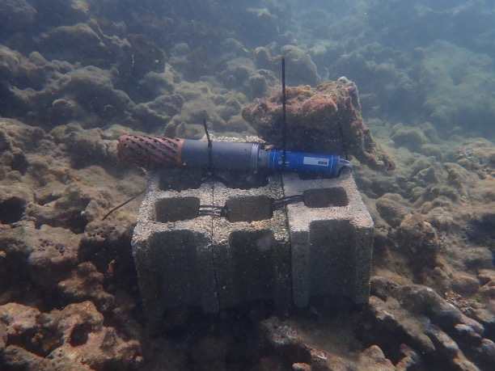
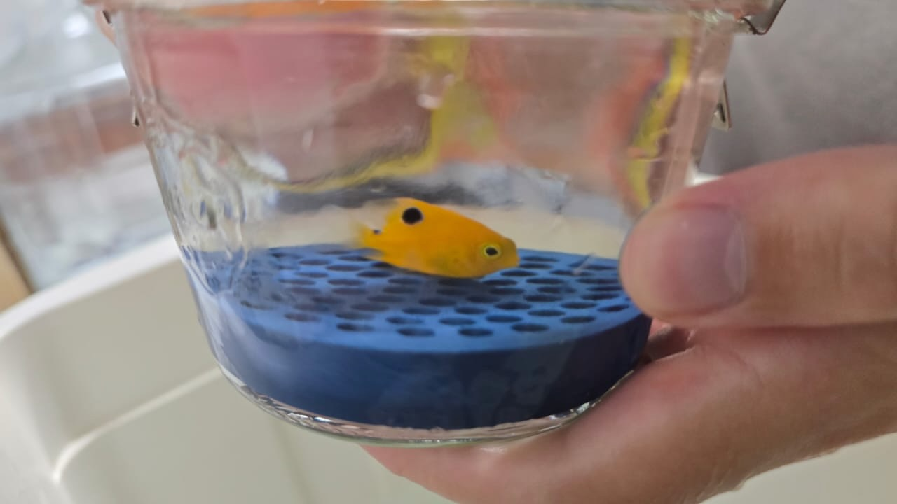
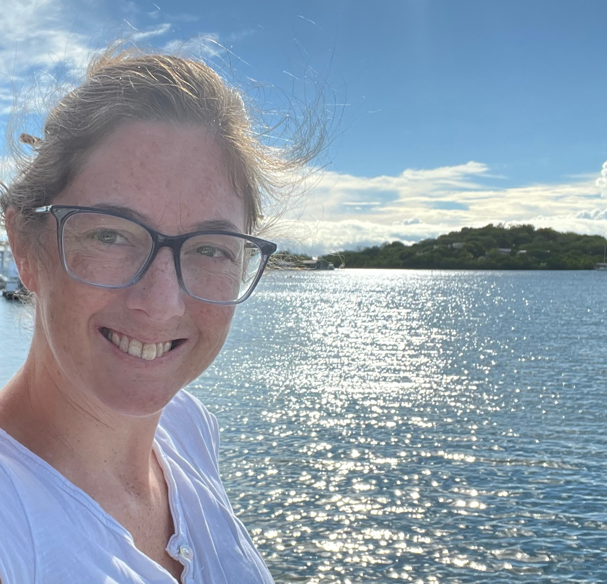

::: {.grid style="gap: 0.25rem;"}
::: {.g-col-4}

{width="100%"}
:::
::: {.g-col-4}
{width="100%"}
:::
::: {.g-col-4}
{width="100%"}
:::
::: {.g-col-4}
{width="100%"}
:::
::: {.g-col-4}
{width="100%"}
:::
::: {.g-col-4}
{width="100%"}
:::
:::

:::{#about-block}
:::

# Welcome!

Our lab’s research aims to assess and mitigate the physiological
consequences of climate change impacting marine organisms and the
ecosystems they make up. Specifically, we use tropical marine
ectotherms, i.e. cold-blooded animals, to understand the consequences of
warming, oxygen loss and acidification in tropical habitats. This focus
is spread across different scientific disciplines to form linkages
between physiology and ecology, oceanography, and marine conservation.
Our intention is to generate research that can support aquaculture
innovation, nature-based solutions, and lead to biodiversity
conservation and the overarching goal of the lab is to develop effective
solutions for equitable tropical marine resources.

# Interests

Physiological adaptation, marine invertebrates, multi-stressor
experiments, climate resilience, integrated multi-tropic aquaculture,
marine habitability and biogeography, compound extreme events, tropical
marine biodiversity, oxygen, hypoxia and metabolism, marine
conservation.

We are a multidisciplinary group connecting climate change impacts to
four distinct fields: physiology, ecology, oceanography, and
conservation.

# Contact

{style="max- object-fit:cover; border-radius:8px; margin-bottom:1rem;"
width="50%"}

**Dr. Noelle Lucey, Assistant Professor**

Please feel free to [contact me](mailto:mail.noelle.lucey@upr.edu) if
you have any questions or would like to discuss potential projects.

**Department** Department of Marine Sciences
<https://www.uprm.edu/cima/>

**Institution** University of Puerto Rico Mayagüez

**Mailing address:** Mayagüez Campus PO Box 9000 Mayagüez, PR 00681-9000

**Physical address:** Isla Magueyes Field Station Department of Marine
Sciences - UPRM Road 304 Interior, La Parguera Lajas, Puerto Rico 00667
