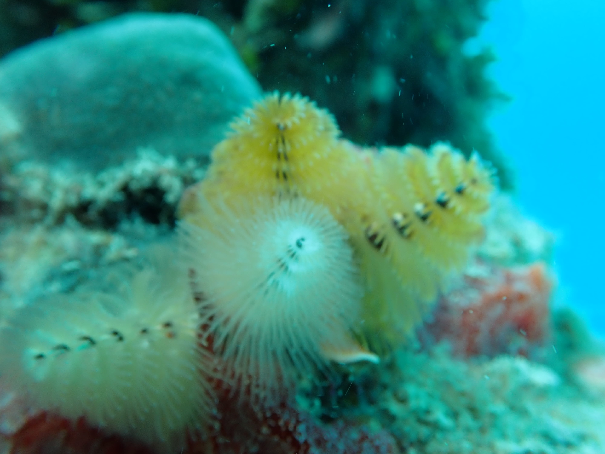
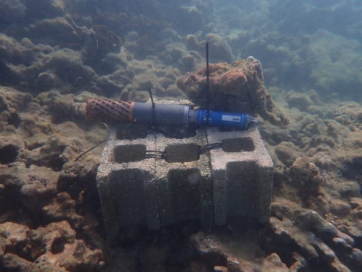
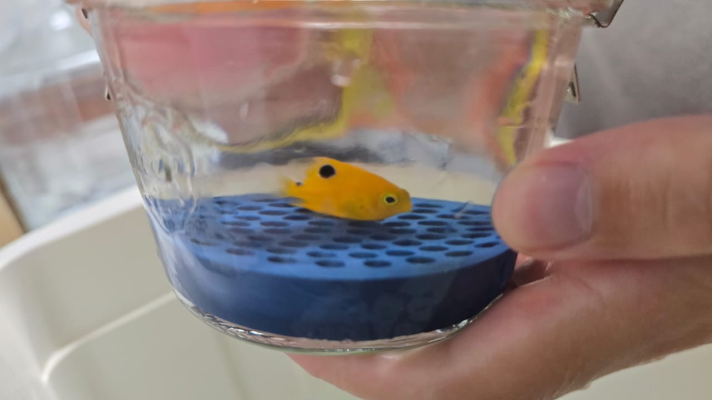
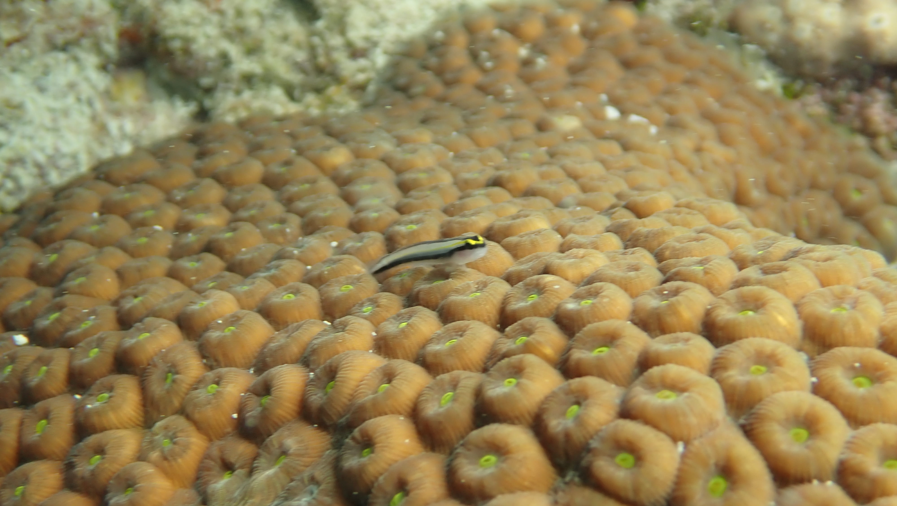
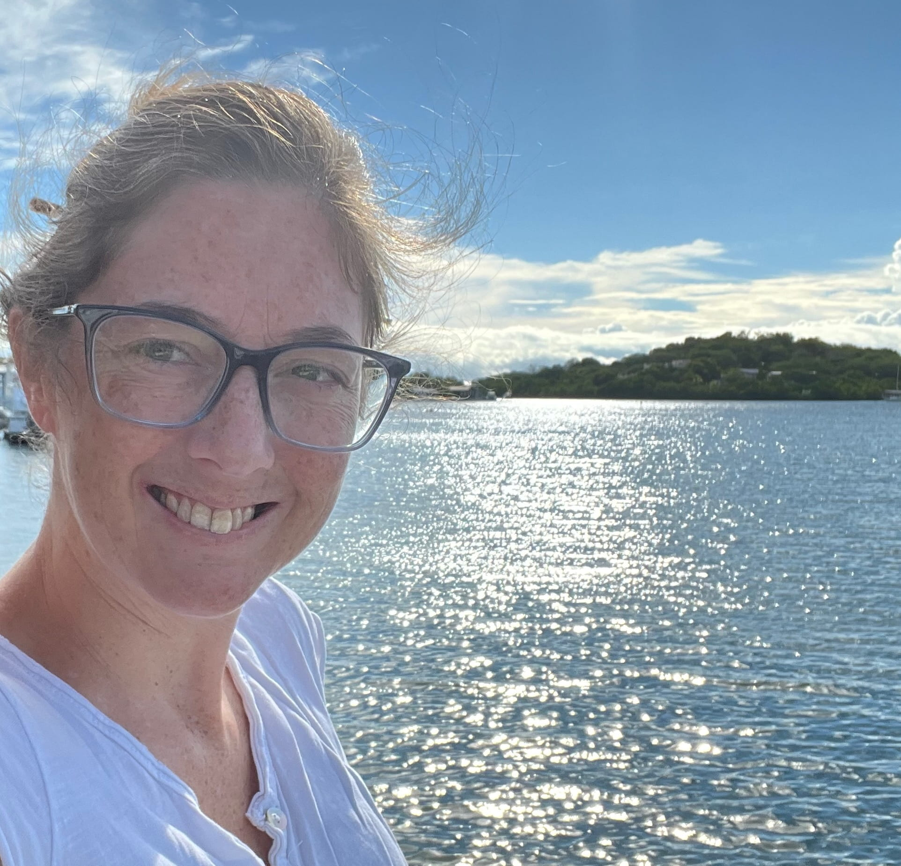

::: {.hero-banner}

::: {.hero-text}
# mare lab
### Marine Aquaculture and Resilience through Ecophysiology

::: {.hero-links}
[ Instagram](https://www.instagram.com/lucey_lab/){.hero-link}
[ BlueSky](https://bsky.app/profile/noellelucey.bsky.social){.hero-link}
[ Github](https://github.com/nlucey20){.hero-link}
[ Email](mailto:mail.noelle.lucey@upr.edu){.hero-link}
:::
:::
:::

:::[#about-block]
:::

# Welcome!

Our lab’s research aims to assess and mitigate the **physiological
consequences** of climate change impacting marine organisms and the
ecosystems they make up. Specifically, we use tropical marine
ectotherms, i.e. cold-blooded animals, to understand the consequences of
warming, oxygen loss and acidification in tropical habitats. This focus
is spread across different scientific disciplines to form linkages
between physiology and ecology, oceanography, and marine conservation.
Our intention is to generate research that can support restorative
aquaculture innovation, nature-based solutions, and lead to biodiversity
conservation. The overarching goal of the lab is to develop effective
solutions for equitable tropical marine resources.

::::::::: {.grid style="gap: 0.25rem;"}
::: g-col-4
{width="100%"}
:::

::: g-col-4
{width="100%"}
:::

::: g-col-4
{width="100%"}
:::

::: g-col-4
{width="100%"}
:::

::: g-col-4
{width="100%"}
:::

::: g-col-4
{width="100%"}
:::
:::::::::

# Research Interests

We are a multidisciplinary group connecting climate change impacts to
four distinct fields: physiology, ecology, oceanography, and
conservation.

Three main themes:

1. Respiratory and metabolic physiology 

2. Physiological diversity of tropical ectotherms

3. Physiological correlates of geographic ranges in marine animals

{.column-screen-inset}

[Keywords: physiological adaptation, marine ecotherms, multistressor
experiments, climate resilience, restorative aquaculture, integrated
multitropic aquaculture, marine habitability and biogeography, compound
extreme ocean events, tropical marine biodiversity, oxygen, hypoxia,
metabolism, marine conservation.]{.smallcaps}

# Contact

{style="max- object-fit:cover; border-radius:8px; margin-bottom:1rem;"
width="50%"}

**Dr. Noelle Lucey, Assistant Professor**

Please feel free to [contact me](mailto:mail.noelle.lucey@upr.edu) if
you have any questions or would like to discuss potential projects.

**Department** Department of Marine Sciences
<https://www.uprm.edu/cima/>

**Institution** University of Puerto Rico Mayagüez

**Mailing address:** Mayagüez Campus PO Box 9000 Mayagüez, PR 00681-9000

**Physical address:** Isla Magueyes Field Station Department of Marine
Sciences - UPRM Road 304 Interior, La Parguera Lajas, Puerto Rico 00667
