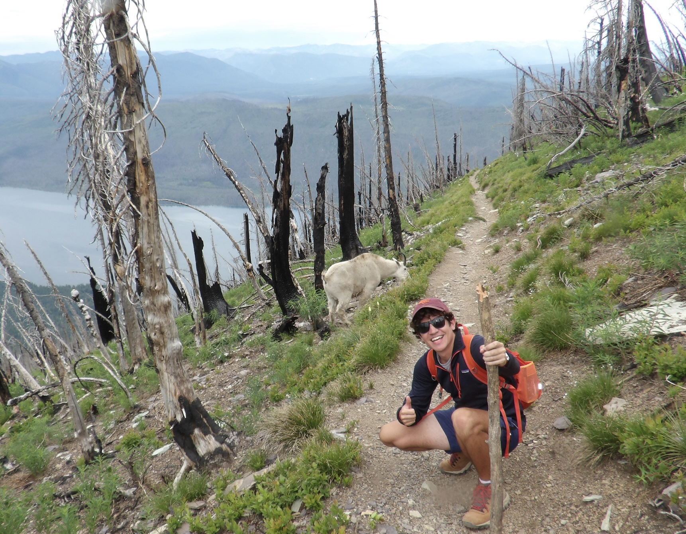
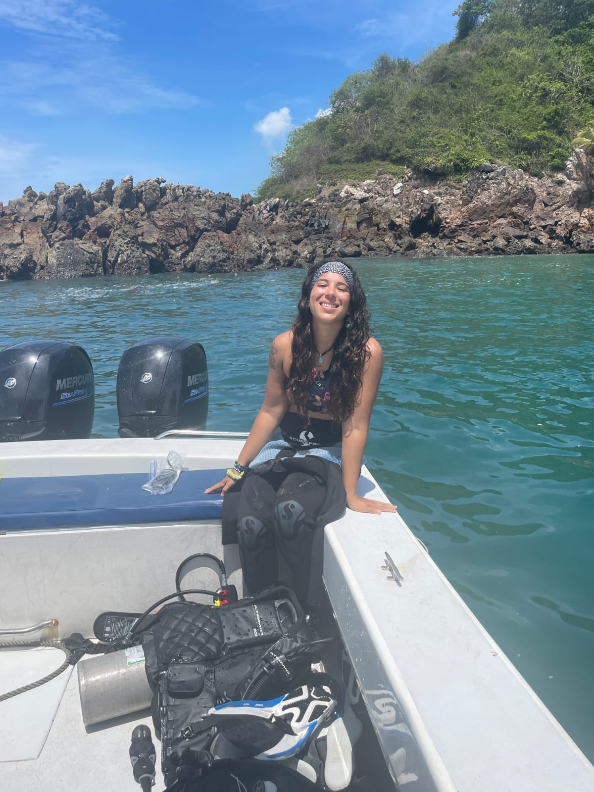

::: {layout-ncol=1}


:::


Currently in the lab:

--- 

{.float-left}

# Noelle Lucey

Growing up in Franklin, NH, surrounded by lakes and rivers, I fell in love with the water early. But I decided I needed more adventure than the lake could provide after reading the book 20,000 Leagues Under the Sea. And on the first page, I discovered "ichthyologist" was a thing, an actual profession that existed where you could explore the ocean. That’s when I decided to be a marine biologist. I never quite made it to "fish doctor" — but I've recently started working with fish, so childhood-me would consider that progress.

My path has moved between science and policy: a Master's in Marine Policy from the University of Miami's Rosenstiel School, and a Ph.D. in Marine Ecology and Evolution through the MARES collaborative doctoral program, between the University of Plymouth (UK) and the University of Pavia (Italy). That back-and-forth between the academic and the applied has shaped how I approach pretty much everything.

Now I'm based at the University of Puerto Rico Mayagüez, where I run a marine lab focused on the physiology of tropical marine organisms, asking how animals cope with a changing ocean. Outside the lab and the water, I make art with glass, hike whenever I can, and spend a lot of time trying to convince people to love the ocean as much as I do. Also a proud dog mom.

---

{.float-right}

# Jonathan Burnap 

From Richmond, Virginia, and a graduate of Virginia Tech with a bachelor's in environmental science. He is studying how different coral reef fish species' tolerances are when it comes to the combined pressure of warming and low oxygen.  He is monitoring the reef fish of La Parguera and running lab-based physiology assays to provide novel data that will set the stage for us to understand  what aspects of reef fish communities are going to deteriorate first with continued extreme ocean weather.  He is also very much at home underwater and likes to spend his free time outdoors by running, golfing, hiking, and more. 

---

{.float-left}


# Carolina César Ávila 

Carolina is originally from La Chorrera, Panama, and has a background in Marine Biology from the International Maritime University of Panama. Before joining the lab in August 2025, Carolina worked as a Research Technician in the Smithsonian's Tropical Research Institute, Bocas del Toro, for the Marine GEO Network. Carolina is passionate about coral reef ecosystems; her research interest explores how compound extreme events affect coral physiology. She enjoys diving, photography, longboarding, birdwatching, and spending time with her cat in her free time.
 
<br>
  

---

{.float-right}

# Mariela Cortes Medina</em> 

Mariela graduated from the University of Puerto Rico Mayaguez with a bachelor's in biology. Previously, she's worked with the Laboratorio de Ecología y Conservación de Vida Silvestre helping with different projects. In her free time, she enjoys doing crafts, having creative projects and spending time in nature from river and beach days to hikes. Her research interests focus on marine 
conservation in macro-organisms and ecology.


---


```{=html}
<div  style="margin: 30px; text-align: center;">
<a class="btn btn-primary" href="https://www.marvinschmitt.com/blog/website-tutorial-quarto/" role="button" target="_blank" style="padding: 15px 30px;">Prospective students, postdocs or volunteers? Click here! </a>
</div>
```